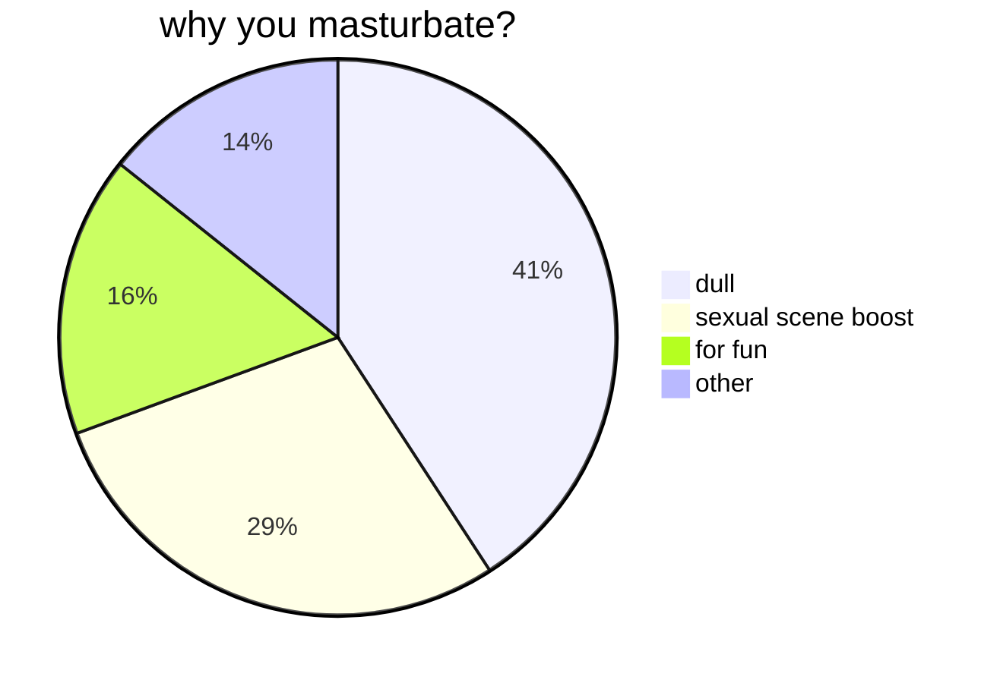
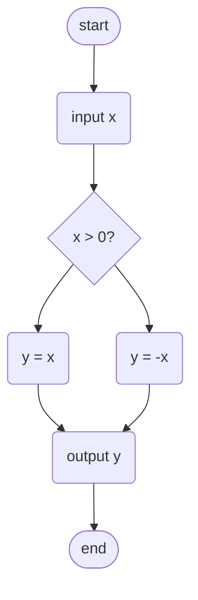

#### investigate


#### absolute algorithm


#### company phone list
<div align="center">

|name|phone|
|:---|:---:|
|*Li Weiping*|18268783355|
|*Wang Taotao*|15988203040|
|*Li Zongping*|15068582771|
|*Huang Xiaochun*|13858508970|
|*Liao Lihui*|18106888837|

</div>

#### golang code snippet
```go
package main

import (
    "fmt"
)

func main() {
    fmt.Println("Hello Markdown!")
}
```

> god bless you 
> talk is cheap, show me your code
> > love ❤️ 


